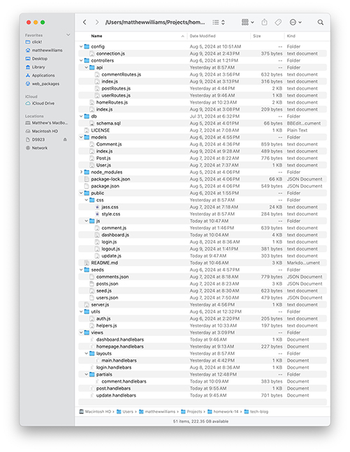
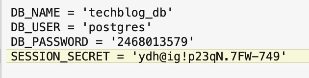

# Tech Blog

## License

MIT License

## Description
Tech Blog is a full-stack application that allows users to write blog posts, update them (see [Future Development](#future-development)), and delete them. It also allows users to add comments to their own blog posts or those written by others and to review comments.

## Table of Contents
- [Installation](#installation)
- [Usage](#usage)
- [License](#license)
- [Future Development](#future-development)
- [Contributing](#contributing)
- [Tests](#tests)
- [Questions](#questions)

## Installation
To install the back end for Tech Blog, download this repo being careful not to change the file and folder structure as shown in the image below.

## Usage
To use Tech Blog, create (or edit) an .env file with your username and password. You can see an example of the structure of a .env file in the image below.

 When you have prepared a .env file, use these commands:

    npm install [installs dependences]
    psql -U postgres [opens PostgreSQL; provide your password when asked]
    \i db/schema.sql [creates the database called "techblog_db"]
    \q to exit the PostgreSQL CLI
    node seeds/seed.js [seeds the database that was created by schema.sql]
    node server [starts the server]

In your browser, navigate to [https://tech-blog-tg0i.onrender.com](https://tech-blog-tg0i.onrender.com) to use Tech Blog. You will be presented with a list of existing blog posts, including the name of the poster and the date on which the post was created. You will also see navigation links in the upper right corner of the page: Home, Dashboard, and Login.

Without logging in, you can read the posts by clicking on their titles. To add posts, delete your posts, and add comments to your own and others' posts, you must login. Click either the Dashboard or Login link to be taken to the login page. You will be prompted to provide your credentials or, if you are not already a registered user, to sign up. After logging in or signing up, you will be taken to your dashboard, which lists all the posts you have made and provides a form for you to create new posts. Once posted, your dashboard will reload, and your new post will be added to the list of your existing posts. When you select one of your posts, you will be given the opportunity to delete the post. You cannot delete others' posts. To return to the list of all available posts, click the Home link. When you choose a post to read, you will have the opportunity to add a comment and also to read previous comments by other users. When you add a comment to a post, the page will reload, and you'll see your comment in the list of comments.

## Future Development
    - The update function is not working, so it's been disabled entirely for this build.
    - The user experience meets the requirements of the brief, but it deviates slightly in some places. It should be modified to meet entirely the requirements of the brief. (This is largely a function of the boilerplate interface and should be addressed after the code is refactored and the design updated.)
    - The code needs to be refactored for efficiency and more logical modularization.
    - The interface is boilerplate and should be updated.

## Contributing
To contribute to Tech Blog, clone this repository locally and commit your code to a separate branch.

## Tests
If you are making core library changes, please write unit tests for your code and ensure that everything is working correctly before opening a pull request.

## Questions
You can see my github repositories at [MatthewWilliamsCMH](https://github.com/MatthewWilliamsCMH/).  
Drop me a line at [matthewwilliamscmh@icloud.com](mailto:matthewwilliamscmh@icloud.com).